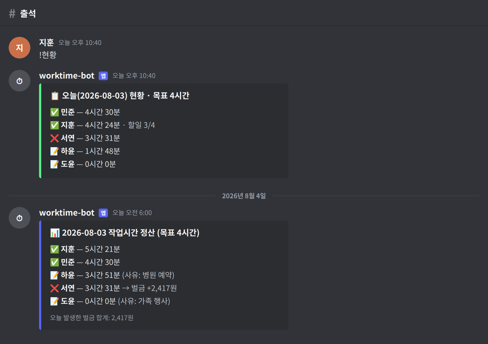

# 디스코드 작업시간 추적 봇

음성 채널에 머문 시간을 하루 단위로 집계해서, 하루 목표(기본 4시간)를 채웠는지 매일 오전 6시에 정산하고, 못 채우면 벌금을 누적해 주는 디스코드 봇입니다. 사정이 있는 날은 미리 사유를 적어두면 그날 벌금이 면제됩니다.



> 위 화면은 실제 사용 예시를 재구성한 것으로, 이름·사유는 임의의 값입니다.

## 어떻게 동작하나

- 등록된 팀원이 음성 채널에 있는 동안 1분마다 시간을 적립합니다.
- 하루 기준은 **오전 6시 ~ 다음날 오전 6시** 입니다. 새벽 늦게까지 한 시간도 그날 몫으로 잡힙니다.
- 하루 시작할 때 `!할일` 로 개인 to-do를 적고, 하는 동안 `!완료 번호` 로 체크할 수 있습니다. 진행도는 `!현황` 에 함께 표시됩니다.
- 매일 오전 6시에 방금 끝난 하루를 정산해서 지정한 채널에 결과를 올립니다.
- 목표를 못 채우면 **부족한 1시간당 5,000원**(기본값)이 벌금으로 누적됩니다. 실제 정산(돈 걷기)은 팀이 알아서 하면 됩니다.

## 준비물

1. 컴퓨터에 **Python 3.11 이상** 설치 (`python --version` 으로 확인. `zoneinfo` 사용 때문에 3.9+ 필수, 3.11 권장)
2. 봇이 24시간 켜져 있어야 그 시간 동안 집계됩니다. 개인 PC를 계속 켜두거나, 클라우드에 올려두면 됩니다. 이 저장소는 **Fly.io** 배포 설정이 포함돼 있습니다 → [4단계](#4단계--24시간-돌리기-flyio)

## 1단계 — 디스코드 봇 만들기

1. https://discord.com/developers/applications 접속 → **New Application** → 이름 입력.
2. 왼쪽 **Bot** 메뉴 → **Add Bot** (또는 Reset Token) → **Copy** 로 토큰 복사. (토큰은 비밀번호이니 노출 금지)
3. 같은 Bot 화면 아래 **Privileged Gateway Intents** 에서 3개 모두 켜기:
   - **PRESENCE INTENT**
   - **SERVER MEMBERS INTENT**
   - **MESSAGE CONTENT INTENT**
4. 왼쪽 **OAuth2 → URL Generator**:
   - SCOPES: `bot` 체크
   - BOT PERMISSIONS: `View Channels`, `Send Messages`, `Embed Links`, `Read Message History`, `Connect` 체크
   - 생성된 URL을 브라우저에 붙여넣어 봇을 서버에 초대.

## 2단계 — 파일 설정

이 폴더에 있는 파일들을 한곳에 두고:

1. `.env.example` 파일을 복사해서 이름을 **`.env`** 로 바꾸고, 안에 복사한 토큰을 붙여넣습니다.
   ```
   DISCORD_TOKEN=복사한_봇_토큰
   REPORT_CHANNEL_ID=정산_결과를_올릴_채널_ID
   ```
   > ⚠️ `.env` 는 절대 GitHub에 올리지 마세요. (`.gitignore` 에 이미 포함돼 있습니다.)
2. (선택) `bot.py` 위쪽 **CONFIG** 부분에서 값 조정:
   - `TARGET_HOURS` — 하루 목표 시간 (기본 4)
   - `FINE_PER_HOUR` — 부족한 1시간당 벌금 (기본 5,000원)
   - `DAY_START_HOUR` — 하루 기준·정산 시각 (기본 오전 6시)
   - `TRACKED_CHANNEL_IDS` — 특정 음성 채널만 인정하고 싶을 때 채널 ID 입력
   - `IGNORE_WHEN_DEAFENED` — `True` 로 하면 헤드셋 끈(귀 막은) 상태는 시간 미인정

> 채널 ID는 디스코드 **설정 → 고급 → 개발자 모드**를 켠 뒤, 채널을 우클릭 → **ID 복사** 로 얻습니다.

## 3단계 — 실행

터미널(명령 프롬프트)에서 이 폴더로 이동한 뒤, **가상환경(venv)** 을 만들어 그 안에 라이브러리를 설치합니다. 시스템 파이썬을 건드리지 않아서 다른 프로젝트와 버전이 꼬이지 않고, 지울 땐 폴더만 삭제하면 됩니다.

**macOS / Linux**

```bash
python3 -m venv .venv
source .venv/bin/activate
pip install -r requirements.txt
python bot.py
```

**Windows (PowerShell)**

```powershell
py -m venv .venv
.\.venv\Scripts\Activate.ps1
pip install -r requirements.txt
python bot.py
```

> PowerShell에서 "이 시스템에서 스크립트를 실행할 수 없다"는 오류가 나면 한 번만
> `Set-ExecutionPolicy -Scope CurrentUser RemoteSigned` 를 실행한 뒤 다시 시도하세요.

터미널 앞에 `(.venv)` 가 붙으면 가상환경 안입니다. `로그인됨: ...` 이 뜨면 성공이고, 창을 켜두는 동안 집계됩니다. 끝낼 땐 `Ctrl+C`, 가상환경에서 나올 땐 `deactivate` 입니다.

다음에 다시 실행할 땐 활성화 한 줄(`source .venv/bin/activate`)만 하고 `python bot.py` 하면 됩니다. 설치는 처음 한 번만 하면 돼요.

> `.venv/` 폴더는 `.gitignore` 에 있어서 저장소에 올라가지 않습니다.

## 4단계 — 24시간 돌리기 (Fly.io)

이 저장소는 **Fly.io** 배포용 설정이 들어 있습니다.

| 파일 | 역할 |
|---|---|
| `Dockerfile` | 파이썬 3.12 이미지에 봇을 담아 실행 |
| `fly.toml` | 앱 이름·리전(`nrt`), 영구 볼륨 `botdata` → `/data`, `DATA_DIR=/data` |
| `.github/workflows/fly-deploy.yml` | `main` 에 push하면 자동 배포 |
| `Procfile` | Railway 등 다른 PaaS용 실행 명령 |

요약하면:

```bash
fly launch --no-deploy                          # fly.toml 의 app 이름은 본인 것으로 변경
fly volumes create botdata --size 1 --region nrt   # 기록 보존용 영구 볼륨 (필수)
fly secrets set DISCORD_TOKEN=봇_토큰 REPORT_CHANNEL_ID=채널_ID
fly deploy
fly logs                                        # '로그인됨: ...' 확인
```

GitHub Actions로 자동 배포까지 쓰려면 `fly tokens create deploy` 로 토큰을 만들어 저장소 **Settings → Secrets and variables → Actions** 에 `FLY_API_TOKEN` 으로 등록하세요. 그다음부터는 push만 하면 배포됩니다.

- 볼륨을 안 붙이면 재배포할 때마다 기록이 초기화됩니다. 꼭 만드세요.
- 봇 토큰은 코드나 `fly.toml` 이 아니라 반드시 `fly secrets` 에 넣습니다.
- 자세한 단계별 설명과 Railway 방식은 [HOSTING.md](HOSTING.md), 오라클 무료 VM 방식은 [ORACLE-SETUP.md](ORACLE-SETUP.md) 를 보세요.

## 명령어

채팅창에 입력하세요. (모든 팀원은 처음에 `!가입` 을 꼭 해야 정산 대상이 됩니다.)

| 명령어 | 설명 |
|---|---|
| `!가입` | 추적 대상으로 등록 |
| `!탈퇴` | 추적 대상에서 제외 |
| `!내시간` | 오늘 내 누적 시간 |
| `!현황` | 오늘 팀 전체 현황 |
| `!주간` | 최근 7일 내 기록 |
| `!할일 알고리즘 3문제` | 오늘 할일 추가 |
| `!할일` | 오늘 내 할일 목록 보기 |
| `!완료 2` | 2번 할일 완료 체크 |
| `!할일삭제 2` | 2번 할일 삭제 |
| `!사유 병원 예약` | 오늘 벌금 면제 사유 등록 |
| `!사유 2026-07-25 가족 행사` | 특정 날짜 사유 미리 등록 |
| `!벌금` | 내 누적 벌금 |
| `!벌금전체` | 팀 전체 누적 벌금 |
| `!정산` | (관리자) 수동 정산 |
| `!도움` | 명령어 목록 |

## 데이터

모든 기록은 **`study_bot.db`** (SQLite) 파일에 저장됩니다. 기본 위치는 `bot.py` 와 같은 폴더이며, `DATA_DIR` 환경변수로 바꿀 수 있습니다(클라우드 배포 시 영구 볼륨 경로, 예: `/data`). 이 파일을 지우면 기록이 초기화되니 백업해 두면 좋습니다. DB에는 디스코드 사용자 ID·표시 이름·할일·사유가 들어 있으니 저장소에 올리지 마세요 (`.gitignore` 로 막혀 있습니다).

## 자주 묻는 것

- **봇이 명령어에 반응 안 해요** → 1단계 3번의 인텐트 3개를 켰는지, 봇에 메시지 권한이 있는지 확인.
- **시간이 안 쌓여요** → `!가입` 을 했는지, AFK 채널이 아닌 일반 음성 채널에 있는지 확인.
- **정산 결과가 안 올라와요** → `REPORT_CHANNEL_ID` 를 정확한 채널 ID로 지정하거나, 봇이 해당 채널에 글쓰기 권한이 있는지 확인.
